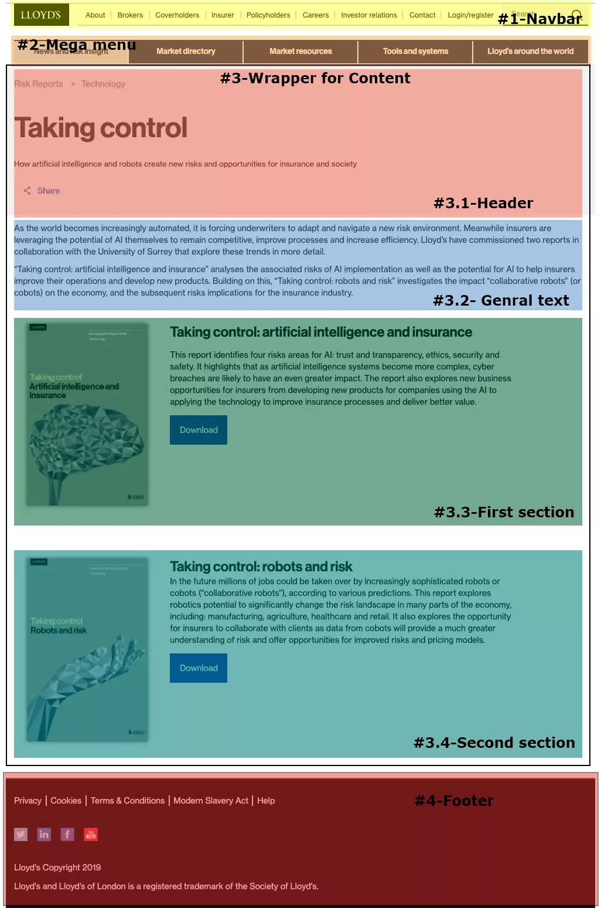
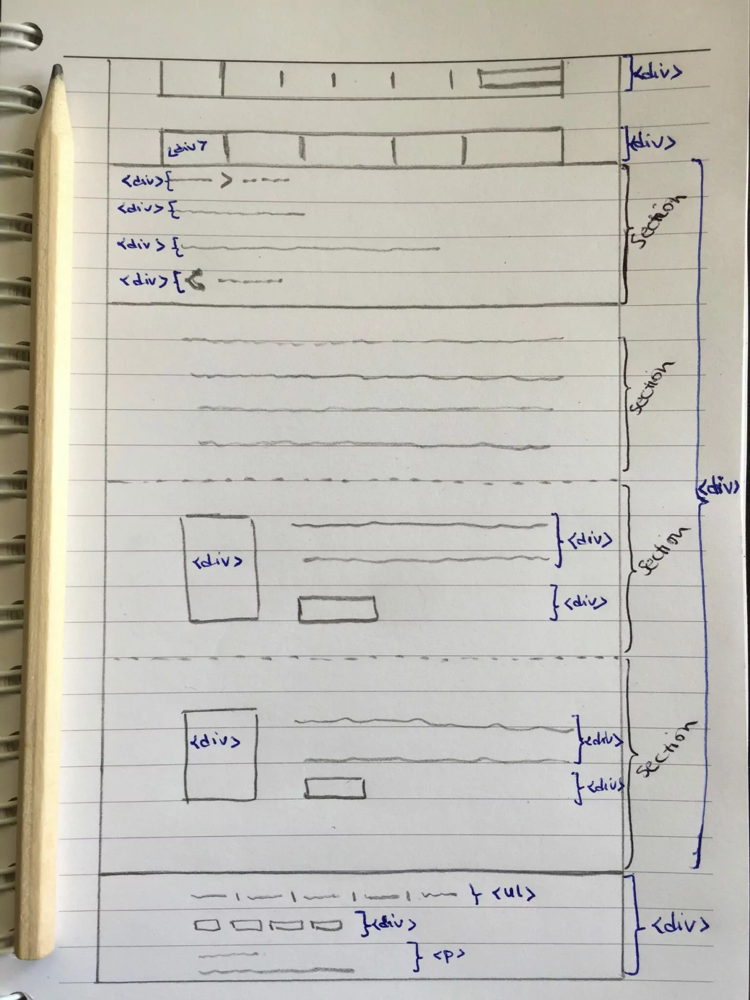

## Pen & Paper: My best friends before starting to code
To be honest with you, I had no idea what I should code at first! So I started to google and figured out how I should begin and process my task to be successful. One of the best articles that I found was [Learning by Cloning: How to Decompose the Problem](https://medium.com/chingu/learning-by-cloning-how-to-decompose-the-problem-102f838a3b19), from [Jim Medlock](https://medium.com/@jdmedlock). After I read it, I tried to follow the instruction in step three and decompose my original website.

At first, I opened the [original website](https://www.lloyds.com/news-and-insights/risk-reports/library/taking-control) and tried to understand the structure of the website. Unfortunately, the design of the website has been changed since I created this blog but I hope you can see the design in the image below as well. I start to markup the site and break it down into small components and pieces according to the content and the responsibility of each piece. This is how it looks like:



Each piece has an individual task.
1. Navbar is responsible for the menu and the navigation between main pages of the website
2. Mega menu is also a menu component, which is much more complicated. It extended dropdown and contains different categories.
3. Wrapper for content represents the main content of the page, and this consists of four sub-components.
4. Footer contains social media links, copyright and some other information.

After I finished analysing the website, I grabbed a pen and paper. This is the easiest way for me to bring everything on paper, which I’m going to code later. I generally create a sketch of the website with the boxes that I created in my last step. Now it’s time to think about HTML tags, that I’m going to use in my code.

Below you can see my sketch on the paper with components and their possible HTML tags.



## Challenges while creating my first sketch for clone a website

As soon as I had a clear plan and knew what I should do and where I should start, everything is much easier and make more sense.

> "Before wasting time and start coding without any plan, take a moment to understand the problem. After that, create a plan, and the last part is starting to code."

I think the essential part of every programming problem or in this case cloning a website is at first to understand the problem. As soon as we understand and analyse the problem, we have done more than 50% of the task. Also, it will help us to solve the rest much more straightforward.

> "Stop trying to be a perfectionist & Believe in your sketch and your solution"

After my first sketch, I started to improve it again and again, which was more time-consuming rather than helpful. I forgot the purpose of my drawing, which was to have a rough plan where and how I should start. I needed my sketch to consider it as the base structure of my code and not to have a beautiful and best draft for the website. So before you make the same mistake as I, jump to the next step. You will always have the chance to make it better or even change your structure if it’s necessary.

## Implement the sketch into code
The requirement for my Chingu project was to clone the website using HTML, CSS and JavaScript. Therefore, I opened my IDE and created an [HTML5 boilerplate](https://www.freecodecamp.org/news/whats-boilerplate-and-why-do-we-use-it-let-s-check-out-the-coding-style-guide-ac2b6c814ee7/) and start to code. But if you want to use any other technical stack or framework, don’t wait longer. Create your boilerplate and kick off your project as soon as possible.

To implement my sketch into code, I started at first to bring each block in my draft as a div in my code. It means at the end I had four divs, and I marked them with different class names. So I prevent to forget what the purpose of each block should be.

```html
<div class="menu-container">
  <nav class="navbar"></nav>
</div>

<div class="dropdown-navbar">
</div>

<div class="wrapper">
  <section class="header-section"></section>
  <section class="general-text"></section>
  <section class="first-section"></section>
  <section class="second-section"></section>
</div>

<div class="footer">
  <ul class="horizontal-list"></ul>
  <div class="social-media-list"></div>
  <p class="footer-text"></p>
  <p class="footer-text"></p>
</div>
```

After that, I had a basement for my code, and I could dig more in each block to expand it. I started with each div to code in details and complete it as same as in the original website.

## Wrapping it up
Cloning a website sounds pretty straightforward. But it can be tough and frustrating if you don’t have any plan for how you want to start and implement it.

Steps to create a website sketch:

Open the original website
- Analyse the website base on structure and task of each part and break it down to small pieces
- Create a sketch of a website on a paper
- Decide for HTML tags
- Don’t try to improve your sketch over and over
- Implement your sketch into code
- These steps helped me to go through this challenge and complete it successfully. Hopefully, it will also help you and make this challenge for you easier. If you have any other idea and would like to share them with me, I would be more than happy to hear from you.

Here you can have a look at the original website. This is the [live version](https://www.lloyds.com/news-and-insights/risk-reports/library/taking-control) of my [cloned website](https://mimifi.github.io/lloyds-clone/) and if you like to know more about my source code, check it [here](https://github.com/mt-tadayon/lloyds-clone) on my GitHub.