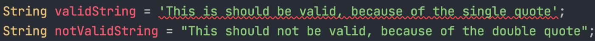
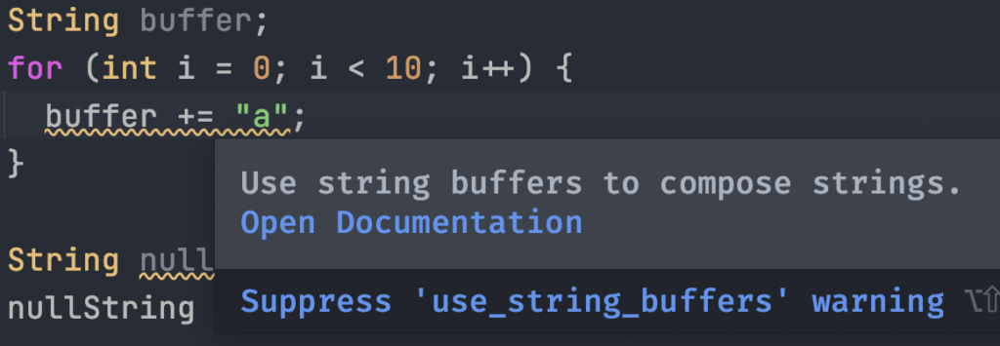
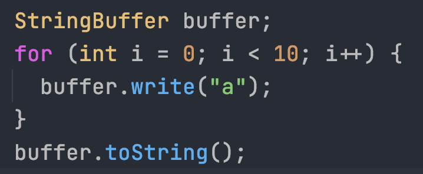
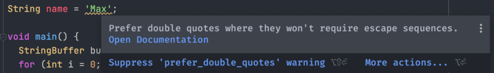
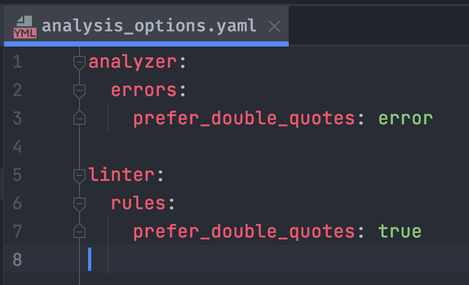
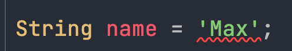
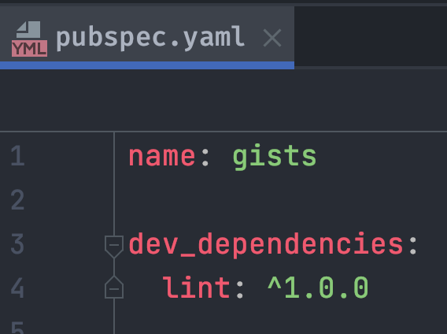
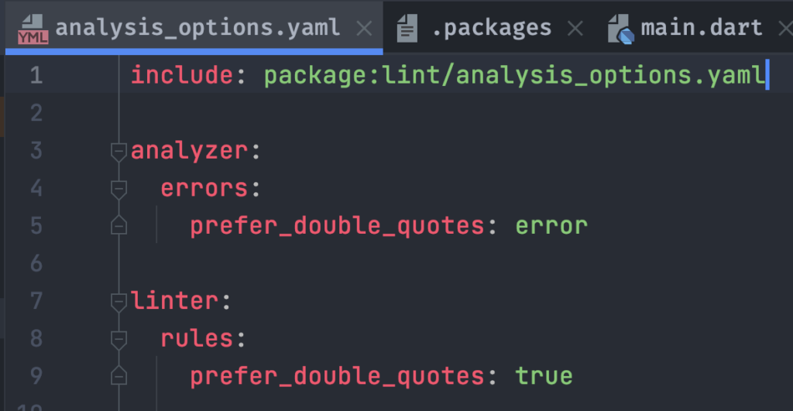

    <iframe width="560" height="315" src="https://www.youtube.com/embed/TBgWVqafJW4" title="YouTube video player"
            frameBorder="0"
            allow="accelerometer; autoplay; clipboard-write; encrypted-media; gyroscope; picture-in-picture"
            allowFullScreen/>

## Setup Code Linting for a Flutter project
In the beginning, let me say that additional Linting in Flutter is a controversial topic. On one side, many love code
linting, because it allows us to focus on crucial parts of our code. However, some people are not fond of it because it restricts
them and leads to false build errors. But before we start the discussion, let us begin with what code linting is and how
we can use its full potential.

Code Linting is an automated verification that your code is correct.
There is always a Linter that we all use in our day to day work.
In editors like VSCode and Android Studio, we receive errors when our code is not runnable.
The visualisation of build errors are already features of our Linter.
This integrated Code Linter is a tool that checks your code for build problems, that means you would not even be
possible to run your application. We do not have to search for errors in our code,
and when everything is green, we are sure that our code is executable.

Thanks to modern tools, we can extend these rules and check our current project for more than just broken code.
For example, we can tell our Linter that we want to check for wrong code styling. In Dart and Flutter the additional
lint rules are managed by a file called analysis_options.yaml. If you have never heard about a yaml file extension,
it is just a convenient way to structure a file that allows you to create tree structures with two spaces. Feel free
to read more about the .yaml file extension [here](https://yaml.org/).

## Our Mission: Enforce single quotes in our project
Let us assume we would force all our developers to work on our project,
that every string should be done with a single quote. Our IDE should show it immediately, like in the image below.

To achieve that the static code analyzer of Dart and Flutter recognize that mistake,
we must create an analysis_options.yaml responsible for our whole project gives our
Dart analyzer instructions that run in the background and verifies our code.
We can create the analysis_options in the root of our project, and most IDE’s like Android Studio
or Visual Studio Code will right away understand what it needs to do with it.
Now, let’s take a closer look into the analysis_options file.
Inside of the analysis_options, we can modify the behaviour of the analyzer and the linter.

## The Analyzer & Linter
In our first section in the common analysis_options.yaml file is usually the analyzer.
Here we can configure a more general part of how we want to check our code.
Firstly, we can set up if we want to show errors, warnings, or as information for specific rules.
Secondly, we can exclude files and folders from the checking system.
Moreover, we can
[ignore specific rules](https://dart.dev/guides/language/analysis-options#ignoring-rules).
Last but not least, we have the chance to introduce additional
[strict type checking](https://dart.dev/guides/language/analysis-options#enabling-additional-type-checks)
and
[experimental behaviour](https://dart.dev/tools/experiment-flags#using-experiment-flags-with-the-dart-analyzer-command-line-and-ide)
like no slow checks or super-mixins.

To use now the main information that we registered to the Analyzer, we have to specify the rules that we want to apply
in our project. Therefore, we use the Linter section of the analysis_options.yaml.
In the linter section, we define which rules are applied to our project.
There are around 180 rules that you can specify and make them right away visible in your application.
To explain, all of them would bust this blog post, so feel free to look at the list of linting rules you can specify
at the Linter for Dart site.

## Linting Rules
At the time I write this post, there are three different categories of Linting Rules. The first is the Error Rules, and they are possible coding errors. Secondly, we have the Style Rules that define code style matters, like a single quote or double quote. It does not hint whether your code is stable or not, but it helps align the whole codebase. The pub rules follow both. This set of rules defines how a pub package has to behave; it includes only two rules on how to name a package and sort dependencies in your pubspec.yaml.

## [avoid_init_to_null](https://dart-lang.github.io/linter/lints/avoid_init_to_null.html)
As the name already states with this linter rule, you do not allow anymore to initialize a variable with null. But why could this be helpful? In Dart, every variable that is not specified with a value is automatically set to null. There is no concept of empty memory or any other trap that we could fall into. With that in mind, a specific declaration of a variable to null would only bloat our code and is unnecessary and unneeded.

## [use_string_buffers](https://dart-lang.github.io/linter/lints/use_string_buffers.html)
Another fantastic rule that many developers are not really aware of is a more performant way to concatenate strings. The String Buffer helps you improve the concatenation of Strings and allows you to do it in the most performant way. To make sure that all contributors in your code concatenate strings efficiently, we can set the [use_string_buffers](https://dart-lang.github.io/linter/lints/use_string_buffers.html) style rule.

## [prefer_double_quotes](https://dart-lang.github.io/linter/lints/prefer_double_quotes.html)
The prefer double quotes rule allows you to take control if you want to enforce a specific quote style. Here we prefer in our code base double quotes but also the single quote rule exists and makes it possible to enforce quote style. This is especially helpful if you work in a multilanguage team because Keyboard layouts differ from country to country. In contrast, in English and American speaking country, the single quote is easier accessible and mostly used in other countries like Germany, the double quote is usually prefered. This rule leads to clear information on how the maintainer or the owner of a package or project wants to work in general.

This is also the rule that we will use to finally solve our problem and enforce double quotes for the whole project.

## The Solution
Alright now that we know how the Linter and the Analyzer work lets solve our goal for this blog post, we want to enforce every developer who works on our codebase to prefer double quotes, and if they do not, we want to really show it as an error. The first thing we have to do is to define the Analyzer with the correct severity of the issue. In our case, this would be “error”. Next, we just defined in the pubspec.yaml our linter with the new rule that we want to add.

Now after we have specified the rule and the severity of the enforcement we can already see in our IDE the errors appearing.

If we now run `dart analyze` in our terminal inside our project, we receive a full analyzing report. Now we can use this command inside our terminal. If we use this command now in our CI / CD chain, the build will fail, and our team would have to fix it to merge it in our project.

## Lint Rules as a package
As always, there are fantastic packages that come with a predefined selection of rules that makes it easier to set up the first baseline that you want to use in your project. Let us first have a look at how we can include them in our project.

## Install a third party linting rule set
In order to add a linting rule set we have to first add the dependency to the pub.dev package in our pubspec.yaml. As an example we want to add the Lint package to our project.

The next step is to import the rules from the package into our analysis_options.yaml.

As soon as you open now the different files, you will now recognize that the package’s linting rules are already taken into account and are ready to use. Let us assume that you do not like a rule. You can easily overwrite the behaviour by including the linter and analyzer. Your rules will overwrite the package’s rules, with that you will always have control over the linting.

### Lint Package
[Pascal Welsch](https://pascalwelsch.com/) creates the first Lint package, and it includes a baseline of lint rules for Flutter and Dart Projects. You can extend or exclude rules afterwards if you use this package, but it is created with consumers. That means if you are not necessarily working on the Flutter project. This should be your way to go.

### Pedantic
The second package that I want to introduce you is the so-called pedantic package. The Flutter team created the pedantic package to support a set of rules that is usually way more restrictive in terms of usage and allowances and is a bit over-engineered from time to time.

## Conclusion
In this post, we learned how to use the Linting Rules to our advantage and enforce rules so that every developer who collaborates with us works in the same way. To generate these rules and discuss them in a team could be tedious, and many people would say that it is not worth the effort. But if the conversation and discussion start now, you have the right tools to join the discussion and give some valuable insights.

Thank you for reading and let me know what you are thinking about Linting rules down in the description below!

Go back [home](/).
