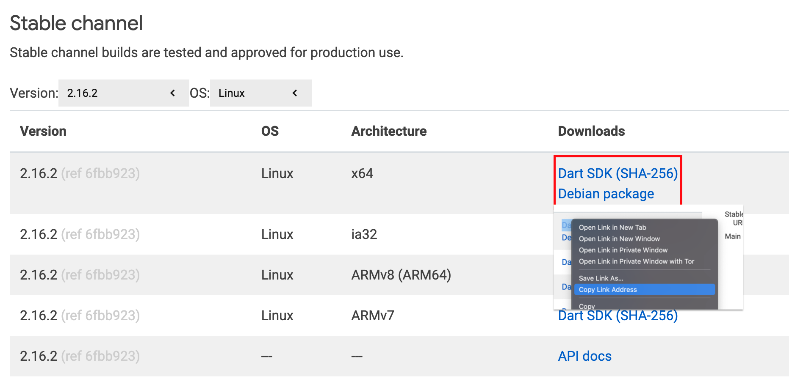

Running the first server is a fantastic experience for every developer.
It gives you many options and possibilities and improves your general understanding of
software engineering. After we learned in my previous [videos](https://www.youtube.com/watch?v=kYM-wlOhQ3I&list=PLq83k-ITj6lQuw6asmdEbuNCV6vVwqT5c)
already how to start a server locally, we want in this article to learn how to make our
services available on the world wide web so that you can access them from every device.

<iframe id="odysee-iframe" width="560" height="315"
        src="https://odysee.com/$/embed/client-server-architecture-build-your/88592c3f4eb4ffd136b1c5b949638dc1ea35b446?r=BJgwk1iRu2HVxyUNS1oX38aRZPJ1YbT9"
        allowFullScreen/>

## Deployment
> Software deployment includes all activities that make a software system available to use. - [Wikipedia](https://en.wikipedia.org/wiki/Software_deployment)

In our use case, we want to access our server from every device connected to the Internet
and not only our local device in front of us. In professional teams, that task is automated in most cases and transforms
quickly. Into continuous deployment where you work on your code, push to a repository, and the deployment gets
automatically triggered. But in smaller teams or smaller organizations, the preferred way is usually for a skilled
professional to perform that task. And because we are skilled professionals, we do exactly that today.

## Prerequisites
We have to prepare just a few things to get started in the beautiful world of deployment. The first thing that we need
is a physical server that will run our software server :). For this reason, we will use [Heroku](https://www.heroku.com/),
because it allows us to run our software for free in a small server [Virtual Machine (VM)](https://en.wikipedia.org/wiki/Virtual_machine)
that we can scale up if we want.

We also need a software service that we already built in the videos mentioned above. The service we want to deploy will
use the [shelf server](https://pub.dev/packages/shelf) from Dart that we already run locally and make our first requests.
But this will also work if you use a [aqueduct server](https://aqueduct.io/) or a [conduit server](https://www.theconduit.dev/).

**Summary of what we need today:**
1. Heroku Account
2. Running Software Server
3. No previous knowledge about deployment processes

## Getting started
After you successfully create an account on Heroku, you will probably see a page that welcomes you to Heroku. From here,
you could also create a new app, but we will do it with the [Heroku CLI](https://devcenter.heroku.com/articles/heroku-cli).


### Heroku CLI
Now that we have that covered let us jump right into it. To begin our journey to deploy something on Heroku, we need to
install the [`Heroku CLI`](https://devcenter.heroku.com/articles/heroku-cli). Then, check out the link of the Heroku CLI
and select the system that fits your operating system.

Great, the Heroku CLI will help us deploy our Server to the Heroku server. After the installation, we first have to
`login` against the Heroku system. For that, execute `Heroku login` in your terminal. After executing the command,
your default web browser will open and allow you to log in to Heroku.

### Create a new Heroku app
The most convenient way to create a new Heroku app is via the CLI. For that, open a terminal and navigate to your
workspace in which your project is. In our example, it will be in `~/dev/dart-server`. Now we want to create our app.
We execute `Heroku create <name-of-your-app>` in our example. We call the app `fe-dart-server`. If you do not pass a name,
it will create a random app name for you.

```bash
heroku create fe-dart-server
Creating ⬢ fe-dart-server... done
https://fe-dart-server.herokuapp.com/ | https://git.heroku.com/fe-dart-server.git
```

As a result, Heroku delivers us two URLs. The first one is the URL directly to our app. Currently, we do not have an
application running on `https://fe-dart-server.herokuapp.com/`.Therefore, you will find the documentation link of Heroku
if you open it. The second link is the internal git server of Heroku, from which it will use your source code to build the project.
We will need to add a new remote to git to push our Dart project.


```bash
# If you have not initialized your project with git
git init
git add remote heroku https://git.heroku.com/fe-dart-server.git
```
** Hint: It could be that if your project was already in git, it was already added with the Heroku create command**

Now that your app is registered to Heroku, we have to set up a [buildpack](https://devcenter.heroku.com/articles/buildpacks).


## How Heroku works
Now it is essential to know how Heroku works. A build pack is responsible for transforming your deployed source
code into a `slug`, which can then be executed by a `dyno`. You can read more about how Heroku works
[here](https://devcenter.heroku.com/articles/how-heroku-works). So before we go deeper into the topic, let's quickly
check what a slug and a dyno are.

> A `slug` is a bundle of your source, fetched dependencies, the language runtime, and compiled/generated output of the build system - ready for execution.

> `Dynos` are isolated, virtualized Unix containers that provide the environment required to run an application.


Source: [devcenter.heroku.com](devcenter.heroku.com)

## Set up a build pack for Dart
Unfortunately, Heroku is not yet supporting `Dart` with an official build pack. Therefore, we have to take advantage of
the fantastic Dart & Flutter Community, which has created already a build pack that we can use. We will use in this tutorial
the most starred build pack by [igrigorik](https://github.com/igrigorik).

To use the build pack, we will have to tell Heroku to use a specific download URL for the Dart language and configure
the build pack we want to use. To find a Dart SDK URL, we check the [Dart Archive](https://dart.dev/get-dart/archive)
page. Then, we select `Linux` and the version we would like to install. This example case is version 2.16.2`, which
is the current version. Now right, click on Dart SDK and copy the link address. We will need it in a second.




Now it is time to set the Dart URL and our `BUILDPACK_URL` for our Heroku app by executing in our terminal.

```bash
heroku config:set DART_SDK_URL=https://storage.googleapis.com/dart-archive/channels/stable/release/2.16.2/sdk/dartsdk-linux-x64-release.zip

Setting DART_SDK_URL and restarting ⬢ fe-dart-server... done, v3
DART_SDK_URL: https://storage.googleapis.com/dart-archive/channels/stable/release/2.16.2/sdk/dartsdk-linux-x64-release.zip

heroku config:add BUILDPACK_URL=https://github.com/igrigorik/heroku-buildpack-dart.git

Setting BUILDPACK_URL and restarting ⬢ fe-dart-server... done, v4
BUILDPACK_URL: https://github.com/igrigorik/heroku-buildpack-dart.git
```

Now it is time to push our source code to Heroku by pushing our source code to the remote git that we got when we created our Heroku app.


```bash
git add .                           # Adds all files to git in this repository
git push --set-upstream heroku main # Sets the upstream branch to heroku main and pushes all files
```

If you are doing it in the terminal, Heroku will give you a lot of logging information about the build process.

```
remote: -----> Discovering process types
remote:        Procfile declares types -> (none)
remote:
remote: -----> Compressing...
remote:        Done: 195.9M
remote: -----> Launching...
remote:        Released v7
remote:        https://fe-dart-server.herokuapp.com/ deployed to Heroku
remote:
remote: Verifying deploy... done.
To https://git.heroku.com/fe-dart-server.git
 	refs/heads/main:refs/heads/main	75c0e7f..b4f1198
Done
```

The log above tells us that everything was successful, but one step is missing.
First, we need to declare the dynos we want for our app. For that, we need to create a `Procfile` in the root directory
of our project. Then, we enter the dyno and what it should start to execute our server. In our case, we execute the
`dart_server.dart` in the bin folder.

```:title=Procfile
web: ./dart-sdk/bin/dart bin/dart_server.dart
```

Hint: The Procfile does **not** have a file extension like `.txt` or `.js`.

If we now `commit` and push again to the Heroku git server we are ready to see our server in action.

```bash
git commit -m "Added Procfile to setup the dyno"
git push --set-upstream heroku main
```

🎉 Great, if everything worked well, you should have now your first running Dart Server on Heroku.

## Troubleshooting
As always, some things could go wrong, and I try to add a collection that we found out during our
[live stream](https://youtu.be/3zKC4RvJOII).

### Dynamic Port
Heroku does not provide you static port, so you will get a new port every time the instance is started.
Especially in the free plan, that happens pretty frequently and therefore, you must take the PORT provided by the
`Environment variables` of Heroku.

```dart
var env = Platform.environment;

var port = env.entries.firstWhere((element) => element.key == 'PORT',
    orElse: () => MapEntry('PORT', '8080'));

var server = await shelf_io.serve(
  logRequests().addHandler(router), '0.0.0.0', int.parse(port.value));
```

### Replace localhost with 0.0.0.0
Heroku is pointing to itself while setup a server you will need to change `localhost` to 0.0.0.0

```dart
var server = await shelf_io.serve(
  logRequests().addHandler(router), '0.0.0.0', int.parse(port.value));
```

## Wrapping up
Great, we did it. With these steps, we published our server to Heroku and made our very first deployment possible.
The next milestone is to create a helpful app out of this server. We were maybe starting with a small quiz app that
allows you and your friends to learn more about development. For that, you will probably need more insights into the
[shelf_router package](https://pub.dev/packages/shelf_router) or an even bigger solution like [Conduit](https://conduit.dev).
Feel free to share your first examples with me on Twitter with the Hashtag [`#FlutterExplained`](https://twitter.com/intent/tweet?hashtags=FlutterExplained). I cannot wait to see your results!
