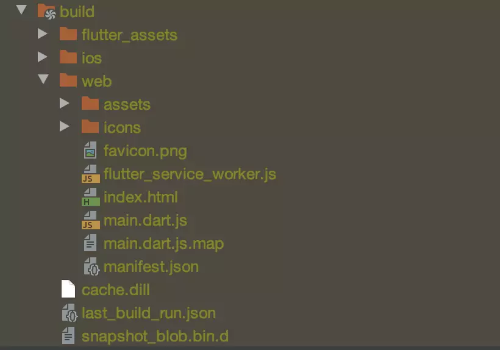
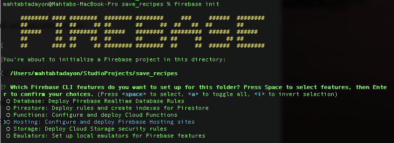
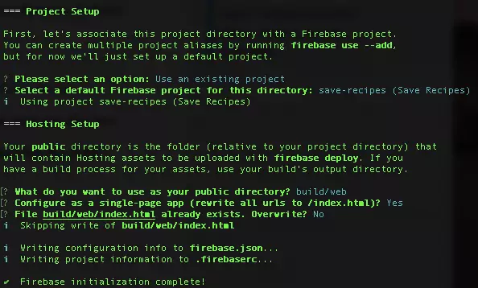
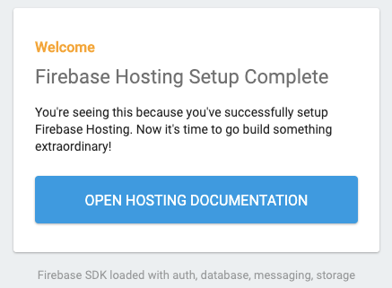

The app helps me to prevent the loss of my future recipes. I’m still working on my project, but meanwhile, I wanted to create also a web project out of it. So I decided to create a Flutter Web Project and deploy that to Firebase Hosting. If you want to publish it under [GitHub Pages](./github-actions), we have also an article for that.

> Firebase Hosting provides fast and secure hosting for your web app, static and dynamic content, and microservices." <br/>
> Firebase Documentation

In this article, I would like to share my experience with you. So let’s start.

<div style={{
    width: "50%",
    height: 0,
    paddingBottom: "50%",
    position: "relative",
    margin: "0 auto",
    boxShadow: "3px 3px 11px 0px rgba(0,0,0,0.75)"
}}>
    <iframe src="https://giphy.com/embed/Ln2dAW9oycjgmTpjX9" width="100%" height="100%" style={{position: "absolute"}}
            frameBorder="0" className="giphy-embed" allowFullScreen/>
</div>

[via GIPHY](https://giphy.com/gifs/memecandy-Ln2dAW9oycjgmTpjX9)

## Prepare the Flutter web project
To deploy a Flutter web project, we have to build the project at first with release build mode of our web app. But before we start with that, let’s see which different kind of build modes we have in Flutter.

## Flutter Build Modes
In Flutter, we have three different [build modes](https://docs.flutter.dev/deployment/web#minification) for different usages:

- Debug mode: During development and to use hot reload.
- Profile mode: To analyze the performance
- Release mode: To release the app

When we create a release build for our app, the bundle is minified, and tree shaking has been performed. So let’s start and build the app in release mode.

## Create a release bundle
Now to run the flutter build, we have to add the release flag to the build function. Open the terminal and navigate into your project folder after that enter the following command.

```bash
flutter build web --release
```

The release build of my save_recipe app looks like following:



After we finished the setup of our Flutter project, it’s now time to set up our Firebase Hosting.

## Firebase Hosting Setup

To set up our project for the deployment to Firebase Hosting, we have to follow some steps that we will go through them step by step.

### 1. Create a Firebase project
The first step to set up our Firebase Hosting configuration is to create a project in Firebase. Therefore, we have to sign in to the [Firebase console](https://console.firebase.google.com/?pli=1) with our Google account.

To create a new project in Firebase, we will go to the Firebase console’s project overview and click on Add Project. Next, we give the project a name and click on continue. Here we can choose if we want Google Analytics for our project or not, and after that, we click on create project.

Now with the project in place, we are set and ready to take the next step. We have to install the [Firebase CLI](https://firebase.google.com/docs/cli) into our project.

### 2. Install the Firebase CLI
There are different options to create the Firebase CLI. In this article, we will use npm to install it on mac. For that, I will open the Terminal and run the following command.

```bash
npm install -g firebase-tools
```

After executing this command I get directly an error message:

```bash
npm WARN checkPermissions Missing write access to /Users/<<username>>/.npm-global/lib/node_modules/firebase-tools/node_modules/string_decoder
npm WARN checkPermissions Missing write access to /Users/<<username>>/.npm-global/lib/node_modules/firebase-tools/node_modules/through2/node_modules
npm ERR! code EACCES
npm ERR! syscall access
npm ERR! path /Users/<<username>>/.npm-global/lib/node_modules/firebase-tools/node_modules/archiver-utils/node_modules/readable-stream
npm ERR! errno -13
```

The error message describes that I do not have the right permissions on the npm folder. To solve this problem I had to run the following command and enter my password:

```bash
sudo chown -R 501:20 "/Users/<<username>>/.npm"
```

And last but not least we should fix the permission problem with the [sudo](https://superuser.com/questions/185441/what-does-the-sudo-command-do/185442#185442) command. After that, I should execute again the command to install the Firebase CLI again.

```bash
sudo npm install -g firebase-tools
```

### 3. Initialize our project
Now it is time to connect our local project to our Firebase project. For this purpose, we have to navigate to the root of our project in the terminal at first. And after that initialize a new Firebase project with the following command.

```bash
firebase init
```

With this command, we will set up our project directory and some Firebase features. As soon as I execute the command, I get the following error:

```bash
zsh: command not found: firebase
```

After some researches, I figure out a solution from durul in [GitHub](https://github.com/firebase/firebase-tools/issues/113#issuecomment-301613705, how to fix it. As the global variable for the zsh is not correctly set, we should set it up at first. To solve this issue, I run this command.

```bash
alias firebase="`npm config get prefix`/bin/firebase"
```

After that, we will execute the previous command again and I get a promising answer now.



### 4. Project Setup
In the next steps, we should configure the Firebase CLI features for our project. To do that, we can navigate between different answers in each question and select our answer with the space key and after that hit the enter key. For the questions with a yes or no answer, we should type just “y” or “n”.

1. Which Firebase CLI feature do you want to set up for your folder? <br/> `Hosting`
1. Select your default firebase project, if you have. In my case, I will select save-recipes project and hit enter.
1. What do you want to use as your public directory? <br/> `build/web`
1. The answer to this question should be the path to our index.html file in our web bundle.
1. Configure as a single-page app? <br/>`y`
1. File build/web/index.html already exists. Overwrite? <br/> `N`



Now our Firebase initialization is done. If we have a look at our project, we can see that Firebase creates two new files in the root of our local project.

The `.firebaserc` file stores our [project aliases](https://firebase.google.com/docs/cli#project_aliases).

And the firebase.json contains the list of our project configuration. If you like to learn more about how to configure customized hosting behaviour, have a look in the [Firebase documentation](https://firebase.google.com/docs/hosting/full-config).

### 5. Deploy our project

We are almost there. The last step is now to deploy our website. For that, we should run this command.

```bash
firebase deploy
```

If everything is going well, we should get the URL to our deployed website.

Hurray!! Here we go, this is the URL to my save-recipes project:

[https://save-recipes.web.app](https://save-recipes.web.app)

Now if we open the link to our website, we should see our web project, which is in our index.html file.

If we open the URL and see the following screen in our browser, it means that we didn’t set the right public directory for our project, which was the third question by the project setup.



To solve this problem, we should just adjust the “public” directory in the firebase.json file to the right path. The directory should point directly to the index.html folder in our web bundle in our local project.

After we change this directory, we should save it and deploy our project again. That means execute again our last command in terminal.

```bash
firebase deploy
```

Now it should work everything as desired, and we should be good to go.

## Conclusion
Creation of a Flutter web project is fast, and you can do it with a single command. In this article, we learned how to deploy our Flutter web project to the Firebase Hosting, which is also possible in a couple of steps.

I highly recommend you to give it a try and let me know in the comments about your experiences.

Thanks for reading and happy coding! 🎉