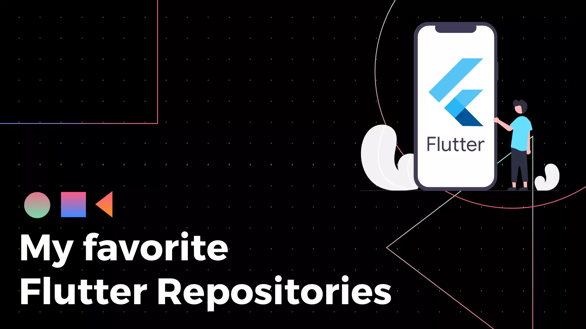
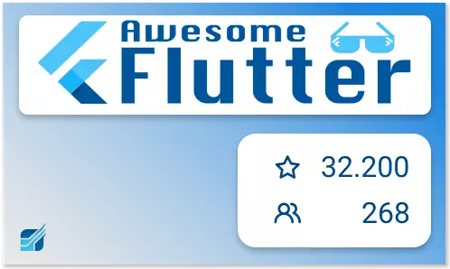
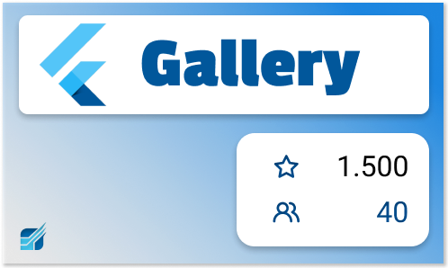
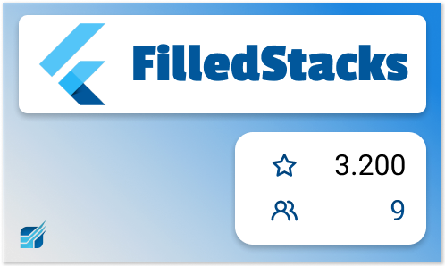
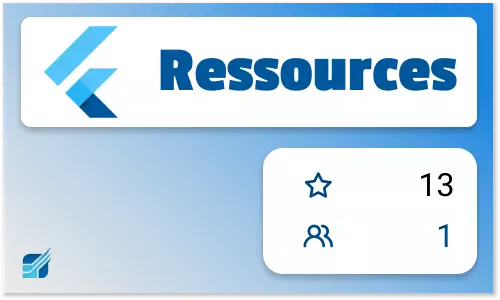
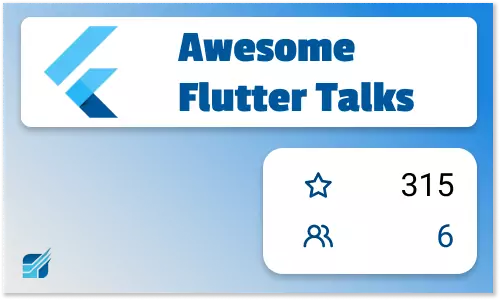

## Awesome Flutter

The first Flutter Repository is created by [Robert Felker, aka Solido](https://github.com/Solido).
You can find a great list of resources that contains a fantastic amount of knowledge about Flutter. It includes further
Ressources like Content Creators, Videos, Tutorials and example Repositories. And the best part, thanks to over 268
contributors the project is still in active development and receives updates regularly. It follows a strict
[“How to contribute”](https://github.com/Solido/awesome-flutter/blob/master/contributing.md) – guideline makes sure to
read it carefully before you add your next fantastic idea.

## Flutter Roadmap

You are a bit lost on your track to enlightenment with Flutter? Search no more the Flutter Roadmap got you covered.
It contains all essential parts of Flutter Software Development that you could think. This package offered me a personal
Learning path. Additionally, I was able to track your personal learning goals. The Main Contributor is Oleksandr Leuschenko,
aka. olexale he also is the author of [arkit_flutter](https://github.com/olexale/arkit_flutter_plugin) that allows AR development with Flutter.

## The official Flutter Gallery

The [Flutter Gallery](https://github.com/flutter/gallery/) is officially inside of the Flutter Teams Repository. The Gallery contains a lot of full-fledged
app examples. You will find demo applications for eCommerce Applications, Financial Services, Travel application and
E-Mail Client. Thanks to the code examples and the fantastic [website](https://gallery.flutter.dev/#/), I was able to convince friends and partners about Flutter.

The Gallery is a fantastic start of your Flutter career and additionally helpful if you want to convince your friends,
partners and clients on how great Flutter is. Last but not least, you can check out the whole repository and start it locally.

## FilledStacks Tutorials

[FilledStacks](https://www.filledstacks.com/) is a YouTuber and Content Creator around Flutter and Dart and has a great library of Tutorials that he
supports with a [Blog](https://www.filledstacks.com/) and [YouTube](https://www.youtube.com/c/filledstacks) videos.
I highly recommend you to check out his repository in which he shares many
insights on how to implement various topics like Firebase Implementation, Mouse Hover, Location Services and State Management.
FilledStacks was one of the first YouTuber I found, and that motivated me to stick with Flutter and learn more.

## Mais Flutter Ressources

One of the newer repositories in which [Mais](https://twitter.com/pr_Mais) collected all her resources for Flutter Development. She collects
an extensive range of information like quick linking of the official documentation, YouTube channels in 2020,
Courses, Tools and many more.

## Awesome Flutter Talks

Another Repository that I look frequently onto is the Awesome Flutter Talks. Here [Rahiche](https://github.com/Rahiche) collected all important talks
in the last couple of years and the list is still growing.

## Mentorship Program

    <iframe width="560" height="315" src="https://www.youtube.com/embed/8nJpxM4TvH0" title="YouTube video player"
            frameBorder="0"
            allow="accelerometer; autoplay; clipboard-write; encrypted-media; gyroscope; picture-in-picture"
            allowFullScreen/>

If you need support in your Flutter Questions. Feel free to check out my [YouTube Channel](https://www.youtube.com/c/flutterexplained)
or my [Mentorship Program](https://flutterexplained.gumroad.com/l/ydgtfV).
Here I will explain to you on real live projects how to work with Flutter and how you will use things like state management,
tooling and I will answer your questions.

The best thing to keep in mind is that all of these repositories can also be supported by you.
If you have additions to all of them, feel free to create a Pull Request and help the developers.
All right, so that is my favourite packages when I started with Flutter, this is now again over two years ago.
Because I want to keep up to date, it would be fantastic if you have more repositories that helped you along the way,
please let me know in the comments below.