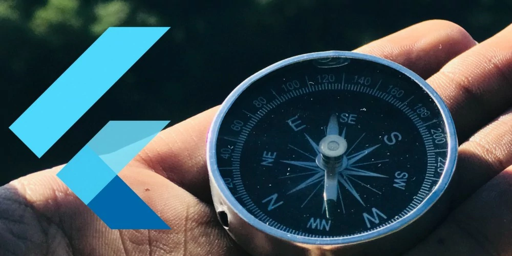
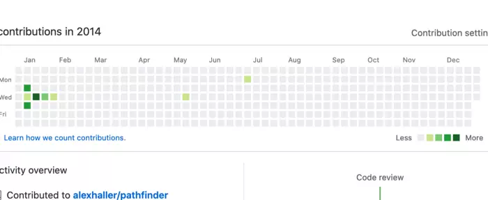
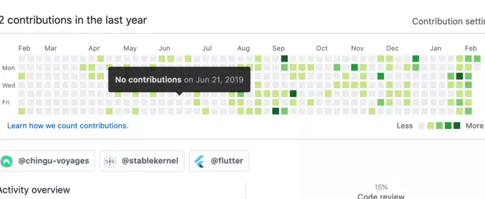

I searched for a strongly typed language that shows me errors before I am falling for them. Now after one and a half year I can say that I transformed from an Angular 2+ engineer to a Flutter engineer and I even started my own Youtube Channel with the topic FlutterExplained.

## First steps
I started by creating some smaller prototypes. Without knowing the Dart Language, I wanted to create my first web app, which I did with the help of [Chingu](https://dev.to/chingu). Chingu is a platform where you collaborate with other members of a community to create a new project.

The first time I used Flutter I used it in a Web Project and developed the backend with [Aqueduct](https://aqueduct.io/). Aqueduct is a framework in Dart, with that you are able to create a scalable backend. That was a fantastic time, learning Heroku added some CI/CD with Github Actions and was able in two weeks to create a web journal full out of Flutter.

It was far from perfect, but jeez I was so proud of it. I wrote [articles](./how-i-created-my-first-flutter-app) and showed it in the community, and they liked it very much. That gave me the drive to work harder on my Flutter skills. At the end of 2019, I finally quitted my Freelance contract and started working full time on Flutter.

## Starting with my Flutter Journey
I wanted to enhance my Flutter knowledge, I completed a certificate on Udemy from the “The Complete 2020 Flutter Development Bootcamp with Dart”. I was glad that I have done it, just to see all things once more together and understand more of the core concepts.

After that, I tried to replenish my social media channels. My [Twitter](https://twitter.com/flutter_exp) activity was not existent and my old youtube channel with around 20 subscribers was not worth a lot. Additionally, I had some ideas in my mind that I wanted to realise. Creating a world travel companion and even an electric calculator (which is currently in Alpha). That was the start of my journey.

First, I developed the electrical calculator to see if I can manage to create an app in one week, and well thanks to Flutter I did! There are some improvements that I have to do, but it will be released in the next weeks. Also, I started with my youtube channel and got till now 400 views on a “MediaQuery and LayoutBuilder” Video, which I used to create a better user experience in my app.

This is super exciting and I am thrilled that it works like that. This motivates me to improve myself even further so that I can explain everyone, even better the pros and cons of Dart and Flutter Development.

## Advantages
I have never learned that much in such a short amount of time. Also for the videos that I prepare, I have to continually improve myself. Learning to cut videos, add effects, creating better boilerplates, learning flutter details and dart packages. Additionally, my partner and me are working to setup up our own startup which takes time to prepare pitches and talk to investors.

My [Github Profile](https://github.com/md-weber?tab=overview&from=2020-02-01&to=2020-02-10) explodes thanks to all the commits and if you compare it to 2014 when I draw little pictures in my timeline, it is a dramatic increase.

Furthermore, I found a way into the flutter community and had the opportunity to talk with people who have the same interest as me. To be part of this new and interactive community is just amazing and the people encourage you to be a better developer in every aspect.

## Downsides

Currently, I am living from my hard work of last year, and there are less till no projects for Flutter Development in Germany. So my clear goal to earn money with Flutter is to create my products, services and apps. Also, my Youtube Channel is one of my critical hopes for income. But there are a lot of barriers and if you think you can earn money with BuyMeACoffee … well, think again.

    <iframe src="https://giphy.com/embed/3o6UB5RrlQuMfZp82Y" width="100%" height="100%" style={{position: "absolute"}}
            frameBorder="0" className="giphy-embed" allowFullScreen/>

## Future perspective and Goals for 2020
I still have to learn a lot about [BloC pattern](https://bloclibrary.dev/#/), state management and advanced API handling with [built_value](https://pub.dev/packages/built_value) and [built_collection](https://pub.dev/packages/built_collection), but that does not keep me away from working further with this great technology.

I would say there was never a technology stack that cared so much about the needs and desires of their developers. The users love the material design and flexibility. Designers see their creation coming alive in no time. The community seems to be still small but is one of the best groups I have ever worked with. All these things combined make me love Flutter.

My goal for this year is to earn a living from Flutter development. The dream would be to go full time on youtube and earn my money as a flutter tutor and speaker. Additionally, I want to publish at least two apps this year.

Thank you for reading so far, please feel free to share your journey with us. I would love to hear more about it.

