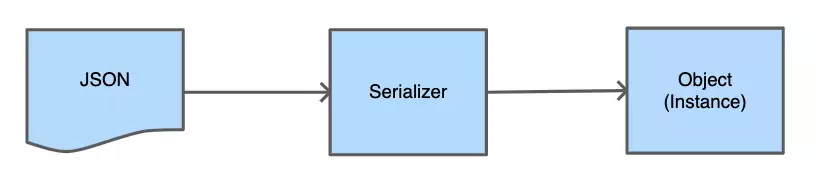
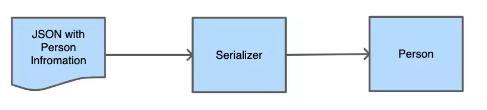
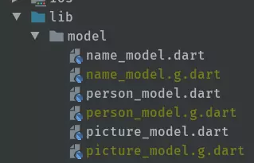

<div style={{display: "flex", justifyContent: "center"}}>
    <iframe id="odysee-iframe" width="560" height="315"
            src="https://odysee.com/$/embed/json-serializer-in-flutter-for-better/a4586049727a4f1be97c325341b5be5b9e1dc478?r=BJgwk1iRu2HVxyUNS1oX38aRZPJ1YbT9"
            allowFullScreen/>
</div>

## General Serialization
Serialization is the process in computer science to convert an object into something that can be saved in a database or be sent via a network request. Today we want to transform a JSON String that we receive from an API and transform it into an instance of an object.




To get our Person information as a String, I will work in the following example with the Random User Generator. This can generate random user information and provides us with an API to receive a JSON String.

## Basic Network Request – Example App
With the help of the [RandomUserAPI](https://randomuser.me/), I created an application that shows us a list of users as soon as we open the app. We create this Application together in the video for a [basic network request](https://www.youtube.com/watch?v=hz2LQ43muio). In the video, we use the manual approach for Flutter JSON Serialization, and with this blog post, we changed that to a more automated process.

If you search the source code for this project and this article please you will find everything [here](https://github.com/md-weber/network_request_tutorial).

<div style={{
    width: "40%",
    height: 0,
    paddingBottom: "80%",
    position: "relative",
    margin: "0 auto",
    boxShadow: "3px 3px 11px 0px rgba(0,0,0,0.75)"
}}>
    
</div>

## Manual Flutter JSON Serialization

To get a better understanding of why we should prefer automatic Flutter JSON Serialization, we have to take a step backwards. For that, we first take a look at how the manual serialization works precisely.

```dart
class Person {
  String name;
  String phoneNumber;
  String imageUrl;

  Person({this.name, this.phoneNumber, this.imageUrl});

  Person.fromJson(Map<String, dynamic> json)
      : name =
            '${json["name"]["title"]} ${json["name"]["first"]} ${json["name"]["last"]}',
        phoneNumber = json["phone"],
        imageUrl = json["picture"]["thumbnail"];
}
```

In the code snippet above, we created a new person object that we receive from our API. As you probably already have seen, we have to write all the key strings into the class and pollute our class with API information. Additionally, we come into the trap that if we want to add or remove an attribute, we have to change it all over.

That makes the maintainability pretty hard. Especially if the API changes and we have to create it from scratch. That would lead to a lot of searches and replacements, and we will lose all IDE supports.

### Benefits
+ No boilerplate surrounding the solution
+ There is no setup required, so you can start directly accessing the parameters
### Disadvantages
- You have to write every line yourself
- Typos can happen and reduce the stability of your application
- For every new Field that you want to add, delete or modify we have to modify the code in the model
- Higher maintenance costs especially for larger projects or with changing API´s

## Generated Serialization
Now that we understand the issues with self-written serialisation let’s have a look at generated Flutter JSON Serialization. There is at the moment not a built-in solution in the Flutter framework, but there are plenty of perfect packages on [pub.dev](https://pub.dev/) for this problem. In this article, we will have a closer look at the [json_serializable](https://pub.dev/packages/json_serializable) package.

The package works powerfully with the build_runner package and allows us to generate the “fromJSON” and “toJSON” functions, without writing all keys of the JSON. We only have to set up our models correctly, annotate them accurately and provide two functions inside. But enough of the words, we want to see some code.

## Dependencies
Before we can begin to work with the json_serializable package, we have to add first some dependencies into our project.

```yaml
dependencies:
  flutter:
    sdk: flutter
  cupertino_icons: ^0.1.3
  http: ^0.12.0+4
  json_annotation: ^3.0.1

dev_dependencies:
  flutter_test:
    sdk: flutter
  build_runner: ^1.8.1
  json_serializable: ^3.3.0
```

The json_annotation is the only dependency that actually has to be inside of our project. The build_runner and json_serializable are just development dependencies and will not be part of the final bundle.

## Modify the model
```dart
part 'person_model.g.dart';

@JsonSerializable()
class PersonModel {
  NameModel name;
  String phone;
  String email;
  PictureModel picture;

  PersonModel({this.name, this.phone, this.email, this.picture});

  factory PersonModel.fromJson(Map<String, dynamic> json) => _$PersonModelFromJson(json);

  Map<String, dynamic> toJson() => _$PersonModelToJson(this);
}
```

Line 1: With the part `person_model.g.dart` we give the PersonModel class the possibility to access the methods inside the person_model.g.dart file. The file will be generated later from the built_runner.

Line 3: The `@JsonSerializable()` annotation tells the build_runner that this class has to be concerned for the generation of a new file and creation of a serialization.

Line 5 + 8: For objects inside our JSON we have to create their representing Model classes for NameModel and PictureModel. The new models will also be annotated with @JsonSerializable() and will also get the two new methods from line 12 and 14.

Line 12: The new [factory](https://dart.dev/guides/language/language-tour#factory-constructors) constructor fromJson is close to our old method. But instead of creating a new Instance of the PersonModel, we call a method _$PersonModelFromJson(json). This method will be generated later with the help of built_runner.

Line 14: The toJson method returns as expected a Json (in Dart a Map between String and dynamic). To receive the map we call the generated function `_$PersonModelToJson(this)`, and pass the current instance inside.

## Unleash the power of the built_runner
After we have successfully created our model with the necessary annotations and functions, we are ready to go for the built_runner script. We open our project in the terminal and execute one of the following commands.

```bash
// Inside of Flutter projects
// Generates the generate files once
flutter pub run build_runner build

// Watches the model files and generates on each change
flutter pub run build_runner watch

// Inside of Dart projects
// Generates the generate files once
pub run build_runner build

// Watches the model files and generates on each change
pub run build_runner watch
```

For the case that you have a regular dart project, I also added the commands for the consistent Dart packages creation. This command will create for you the additional *.g.dart files. These files can be inserted into .gitignore, as everyone in the team can execute this command.



Let us have a more in-depth look into the generated file from the serialisation. Here you can see the two functions that we call in the fromJson and toJson of the partial class.

```dart
// GENERATED CODE - DO NOT MODIFY BY HAND

part of 'person_model.dart';

// **************************************************************************
// JsonSerializableGenerator
// **************************************************************************

PersonModel _$PersonModelFromJson(Map<String, dynamic> json) {
  return PersonModel(
    name: json['name'] == null
        ? null
        : NameModel.fromJson(json['name'] as Map<String, dynamic>),
    phone: json['phone'] as String,
    email: json['email'] as String,
    picture: json['picture'] == null
        ? null
        : PictureModel.fromJson(json['picture'] as Map<String, dynamic>),
  );
}

Map<String, dynamic> _$PersonModelToJson(PersonModel instance) =>
    <String, dynamic>{
      'name': instance.name,
      'phone': instance.phone,
      'email': instance.email,
      'picture': instance.picture,
    };
```

Here are all the strings that we had to create beforehand inside of these methods. Thanks to built_runner they getting now generated for us. If you take a look at line 18, you can see that even the child models are generated correctly. If we now change something in our class and execute once more the build runner (or let it watch), then we will see how it gets added to the list automatically.

### Benefits
- Modifications to the class are instantaneously reflected
- Lower maintenance due to less written code
- Types are directly set via the attributes
- No magic happens, the generated files are in the project

### Disadvantages
- Initial setup is increased
- There is some boilerplate involved
- You have to make sure everyone on the team is aware of the build_runner function (possible solution would be a script or a good readme.md file)
- Generated files could distract from the real model files

## Packages for Flutter JSON Serialization
There are several other packages that you can use for generated JSON Serialization.

### built_value / built_collection
The [built_value](https://pub.dev/packages/built_value) or [built_collection](https://pub.dev/packages/built_collection) can handle JSON Serialization in a very similar way as we did in json_serializable. But add beneficial functions like immutability, comparability and other quality of life functions.

### dart_json
The [dart_json](https://pub.dev/packages/dart_json) has the benefit that it is absolutely dependency less. If you search for a solution with as few dependencies as possible this package is your best bet.

### JSON Web parser
There is some [JSON Web parser](https://app.quicktype.io/?share=Dxzba5UONSYqWKLpCbog) that creates out of your JSON a valid dart model for you. You can copy a JSON into the left side and copy the model on the right side into your application.

## Conclusion
JSON Serialization is a crucial topic, primarily if you work with a lot of external requests and different API´s that are changing their contracts from time to time. These should lead to more productivity so that we can implement significant features easier.

I made a poll on twitter to see which framework is the most used at the moment, but it seems it is pretty close together. My recommendation is to take a look at each package/solution and then use which one fits your needs best.

<blockquote className="twitter-tweet" data-dnt="true" data-theme="dark"><p lang="en" dir="ltr">Hey everyone, its again
    poll time.<br/>What is your favourite Flutter / Dart JSON Serializer? <br/>And please let me know why or if I
    missed an important one :)<a
        href="https://twitter.com/hashtag/flutterdev?src=hash&amp;ref_src=twsrc%5Etfw">#flutterdev</a> <a
        href="https://twitter.com/hashtag/jsonserializer?src=hash&amp;ref_src=twsrc%5Etfw">#jsonserializer</a> <a
        href="https://twitter.com/hashtag/API?src=hash&amp;ref_src=twsrc%5Etfw">#API</a></p>&mdash; Max Weber 💙
    (@flutter_exp) <a href="https://twitter.com/flutter_exp/status/1246774216327823361?ref_src=twsrc%5Etfw">April 5,
        2020</a></blockquote> <script async src="https://platform.twitter.com/widgets.js" charSet="utf-8"/>

Thank you for reading and stay curious.

