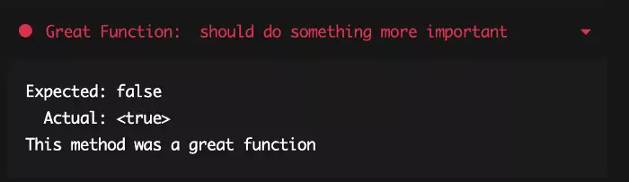

import YouTube from "react-youtube";

In the first episode of our CI / CD blog, we worked with [GitHub Actions](./github-actions). In our last project, we decided to work with the CI / CD solution Codemagic. We were delighted with the tool and could solve some issues in our codebase that happens to probably every development team.

To help you get started I highly recommend you take a look into one of my videos where I explain in detail CI and CD.


<div>
    <YouTube videoId={"kR0N_Ecv_b0"} containerClassName={"youtube-container"}/>
</div>

## Save Recipe App
Whenever we want to try a new recipe in our home, we will search on the internet and select a random recipe for cooking or baking. But as soon as we had our dinner or the cake, we can not remember and find the recipe anymore. Therefore, my partner and I decided that the world is ready for a save recipe app where we can store screenshots of all the delicious recipes that we find on the internet.

The app is currently an MVP, but it has already most of the functionality that we want to deliver. This app will be today the example for our article.

<div>
    
</div>

We created already a Codemagic build pipeline for it. We configured it that way that whenever we push on the master branch in GitHub, it starts the build and deployment process. Feel free to check out our repository and give the project a star on GitHub.

## CI / CD with Codemagic
For those who never heard anything about Codemagic, I want to give a brief overview about the solution. Codemagic is a solution to create Continuous Integration (CI) and Continuous Delivery (CD) for mobile apps. It began as a pure Flutter CI / CD SaaS and is therefore strongly aligned with Flutter development. So if you or your company program in Flutter I can highly recommend you to take a look at it.

Thanks to a CI / CD like Codemagic, we can run our tests and deploy without doing anything additionally as pushing to the master branch furthermore, because the pipeline runs the Analyzer, Tests and releases immediately. That creates us a safety net which helps us to avoid some common issues that happen in every team from time to time. So we want to give you a glance at what could go wrong and how you can debug this problem.

### 1. Compiler Error in our code
Let us begin with a problem that very rarely occurs, but if it happens, it blocks a lot of team members and is usually extremely expensive. So we confine our code base with some compiler errors. We push the broken code to our branch on GitHub, and we merge it to the master branch. A new build will start to run, and a couple of minutes later, we will see the following message in our build overview.

```bash
Test run failed: Flutter analyze found issues.
```

The message states that the Flutter analyses did not pass, and our pipeline found issues. To receive more information, we open the testing tab and see in the results part which issues we have.


Flutter tests result with Analyzer problems


The Flutter analyser found the mistakes that we did and shows in the logs the problematic areas. I point this “basic” error out because it helps us to find issues and protect our application from defect code. Finally, our team can be sure that after the CI / CD pipeline runs, our team does not have to fear defect code and with that a code freeze.

### 2. Broken Unit- or Integration tests
The most natural and most widespread problem that we run into are broken unit or integration tests. When one of our tests failed, we could find the problem very easily by checking the testing part on the dashboard. The build logs are very expressive, and the result messages give us the right direction.

Test run failed: Flutter test run failed.

```bash
Test run failed: Flutter test run failed.
```

Thanks to the dashboard, we must jump into the testing tab and see here the log and results in tabs.




The result tab offers us the possibility to find the broken tests very quickly, and we can even select the test to receive the reasons from Dart Test. Another benefit is that all criteria are running through, and it does not stop at the failed test.

The CI / CD helps us, in that case, to keep our code working correctly. We secure the stability of the source code. Thanks to the necessity to run all the tests, we make sure that everyone handles their changes and the inspections are the safety net for that we create them.

### 3. Wrong app-specific password
Hurray, our app is ready to get published to the App Store, we run into issues.

```bash
Test run failed: Flutter test run failed.
```

To get more information about our error, we open the dashboard and open the publishing part.


In the picture above you find the following errors

```bash
Error: Unable to validate archive “/Users/builder/ipas/Save_Recipes.tpa
Error: code –22020 (Unable to validate your application. We are unable to create an authentications session.)
```

This error messages unfortunately still do not help us what exactly went wrong. So we needed the first time the SSH access to get more details about this error. To do so, we must run the build manually and activate the “Enable Remote Access” in the specified build configuration window.


To connect to the build machine, we need to open our Terminal and paste the statement that we get on the top of the codemagic dashboard for SSH access. After we connect to the build machine, we run in our terminal the last executed command, which you can find in the Publish area in blue.

The added verbose attribute helps us to get way more detailed information of the command and shows us additional error messages that we can use to figure out what went wrong.


Here we get the error message that the app-specific password is wrong. To solve this, we need to create an app-specific password in the app store. This password provides a secure process for a third-party app to connect with Apple Store via our Apple ID. To create this password, you can follow the steps in the apple portal.

After we created our app-specific password, we head back to the configuration of our app in Codemagic. Here we have to update the app-specific password in the field iOS code signing. If you now start a new build, the problem is solved, and your build passes successfully.

The work with the SSH tool was mind-blowing. It helped us to identify the problems and solved them inside of our CI / CD tool. It showed us how vital SSH access to the running build system is if the UI cannot be expressive enough.

## Conclusion

I hope that these solutions for our three expensive mistakes will help you in the future to avoid these problems within your build pipeline. Thanks to the integration with Codemagic, we managed to save time, increase our stability and prevent from expensive code freezes.

Please let us know in the comments below, which CI / CD tool you normally use for your projects and what problems you already solved with it.


